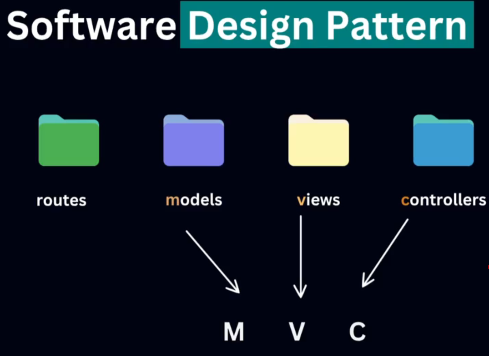
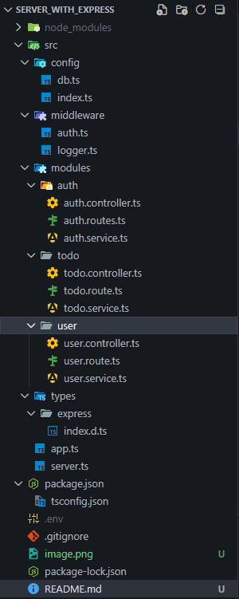

````md
# 🧩 Express + TypeScript Server Architecture Notes

---

## ⭐ 1. Software Design Pattern (High Level Idea)

Software design pattern মানে হলো —
**code লেখার একটা smart, organized, reusable system**
যাতে project বড় হলেও maintain, extend এবং debug করা সহজ হয়।


### 🔄 Conceptual Flow

Interfaces → Routes → Models → Views → Controllers

### 🖼 Diagram
````


### 🔍 Short Explanation

* **Interfaces**

  * TypeScript এর interface / type
  * Data কেমন হবে, কোন field থাকবে – সেগুলোর shape define করে
  * Example: User, Todo, Product ইত্যাদির structure

* **Routes**

  * কোন URL hit করলে কোন কাজ হবে সেটা define করে
  * Example: `GET /api/todo`, `POST /api/auth/login`
  * শুধু path + HTTP method decide করে, logic আলাদা ফাইলে থাকে (controller/service)

* **Models**

  * Database structure (schema / table)
  * Example: MongoDB schema, SQL table etc.

* **Views**

  * User যা দেখে (HTML, React, template ইত্যাদি)
  * Pure API backend এ সাধারণত View থাকে না

* **Controllers**

  * Route থেকে আসা request handle করে
  * Input validate করে, service কে call করে
  * Finally response পাঠায়

> Modern API projects এ MVC + Modular mix pattern use করলে code clean থাকে।

---

## 🧱 2. Modular Pattern

Modular pattern মানে —
পুরো project টাকে **feature-wise ভাগ করা**।
Example:

```text
src/modules/
  ├── auth/
  ├── user/
  └── todo/
```

প্রতিটি module সাধারণত এরকম থাকে:

```text
auth/
 ├── auth.controller.ts
 ├── auth.service.ts
 └── auth.route.ts
```

### 🖼 Visual Idea



---

## ✅ 3. Benefits of Modular Pattern

1. **Clean Structure**

   * Feature অনুযায়ী আলাদা folder
   * দেখলেই বোঝা যায় কোন ফিচারের code কোথায়

2. **Easy Maintenance**

   * এক module change করলে অন্য module ভাঙে না
   * Bug isolate করা সহজ

3. **Reusability**

   * Generic logic আলাদা service আকারে reuse করা যায়

4. **Scalable Architecture**

   * Project বড় হলেও structure ভাঙে না
   * নতুন module add করা সহজ: `blog`, `order`, `payment` ইত্যাদি

5. **Team Collaboration Friendly**

   * Different dev → different module
   * Merge conflict comparatively কম

---

## ⚖️ 4. MVC vs Modular Pattern (Comparison)

| Topic       | MVC (Model-View-Controller)    | Modular Pattern (Feature-based)       |
| ----------- | ------------------------------ | ------------------------------------- |
| Structure   | Model, View, Controller        | auth, user, todo, product… (features) |
| Grouping    | Responsibility-based           | Feature-based                         |
| Use Case    | Traditional web apps, SSR apps | Modern REST/JSON APIs                 |
| Scaling     | বড় হলে একটু messy হতে পারে    | খুবই সহজে scale করা যায়              |
| Readability | New dev–এর জন্য বুঝতে medium   | New dev–এর জন্য বোঝা অনেক easier      |

**Short summary:**

> MVC = *কাজের ধরন* অনুযায়ী ভাগ
> Modular = *feature* অনুযায়ী ভাগ
> Modern Node/Express API তে **Modular pattern super useful** ✅

---

## 🗂 5. Typical Folder Structure (Express + TypeScript)

```text
src/
 ├── config/
 │    ├── db.ts
 │    └── index.ts
 ├── middleware/
 │    ├── auth.ts
 │    └── logger.ts
 ├── modules/
 │    ├── auth/
 │    │     ├── auth.controller.ts
 │    │     ├── auth.service.ts
 │    │     └── auth.route.ts
 │    ├── user/
 │    │     ├── user.controller.ts
 │    │     ├── user.service.ts
 │    │     └── user.route.ts
 │    └── todo/
 │          ├── todo.interface.ts
 │          ├── todo.controller.ts
 │          ├── todo.service.ts
 │          └── todo.route.ts
 ├── types/
 │    └── express.d.ts
 ├── app.ts
 └── server.ts
```

---

## 🔁 6. Request Flow (কীভাবে request ঘুরে আসে–যায়)

```text
Client (Frontend / Postman)
        ↓
Route (todo.route.ts)
        ↓
Middleware (auth, logger, etc.)
        ↓
Controller (todo.controller.ts)
        ↓
Service (todo.service.ts – business logic)
        ↓
Database (Mongo / SQL / etc.)
        ↓
Controller (formats result)
        ↓
Response → Client
```

---

## 🧪 7. Real Example: Todo Module (TypeScript + Express)

এখন দেখি একটা ছোট্ট **real code example** – যাতে Junior-রা সহজে বুঝতে পারে
module, controller, service, route কীভাবে কাজ করে।

### 📁 7.1 Folder: `src/modules/todo`

```text
src/modules/todo/
 ├── todo.interface.ts
 ├── todo.service.ts
 ├── todo.controller.ts
 └── todo.route.ts
```

---

### 🧾 7.2 `todo.interface.ts` (Type Definition)

```ts
// src/modules/todo/todo.interface.ts

export interface ITodo {
  id: string;          // unique id (string)
  title: string;       // কাজের নাম
  description?: string; // ইচ্ছে করলে description থাকবে
  isCompleted: boolean; // কাজ done হয়েছে কিনা
  createdAt: Date;
  updatedAt: Date;
}
```

> এখানে আমরা শুধু **shape define করছি**, actual database logic অন্য জায়গায় থাকবে।

---

### ⚙️ 7.3 `todo.service.ts` (Business Logic Layer)

এখানে আমরা আপাতত in-memory অ্যারে ব্যবহার করব
(পরে এটাকে খুব সহজে real database দিয়ে replace করা যাবে)।

```ts
// src/modules/todo/todo.service.ts

import { ITodo } from './todo.interface';
import { randomUUID } from 'crypto';

let todos: ITodo[] = []; // temporary in-memory storage

export const TodoService = {
  // ✅ Create new todo
  createTodo(payload: Pick<ITodo, 'title' | 'description'>): ITodo {
    const newTodo: ITodo = {
      id: randomUUID(),
      title: payload.title,
      description: payload.description,
      isCompleted: false,
      createdAt: new Date(),
      updatedAt: new Date(),
    };

    todos.push(newTodo);
    return newTodo;
  },

  // ✅ Get all todos
  getAllTodos(): ITodo[] {
    return todos;
  },

  // ✅ Get single todo by id
  getTodoById(id: string): ITodo | undefined {
    return todos.find((todo) => todo.id === id);
  },

  // ✅ Update todo
  updateTodo(
    id: string,
    payload: Partial<Pick<ITodo, 'title' | 'description' | 'isCompleted'>>
  ): ITodo | null {
    const index = todos.findIndex((todo) => todo.id === id);

    if (index === -1) return null;

    todos[index] = {
      ...todos[index],
      ...payload,
      updatedAt: new Date(),
    };

    return todos[index];
  },

  // ✅ Delete todo
  deleteTodo(id: string): boolean {
    const prevLength = todos.length;
    todos = todos.filter((todo) => todo.id !== id);
    return todos.length < prevLength;
  },
};
```

> Real project এ এখানেই তুমি MongoDB / Prisma / Sequelize ইত্যাদি use করবে।

---

### 🎮 7.4 `todo.controller.ts` (Controller Layer)

```ts
// src/modules/todo/todo.controller.ts

import { Request, Response, NextFunction } from 'express';
import { TodoService } from './todo.service';

export const TodoController = {
  // POST /api/todos
  createTodo(req: Request, res: Response, next: NextFunction) {
    try {
      const { title, description } = req.body;

      if (!title) {
        return res.status(400).json({
          success: false,
          message: 'Title is required',
        });
      }

      const result = TodoService.createTodo({ title, description });

      return res.status(201).json({
        success: true,
        message: 'Todo created successfully',
        data: result,
      });
    } catch (error) {
      next(error);
    }
  },

  // GET /api/todos
  getAllTodos(req: Request, res: Response, next: NextFunction) {
    try {
      const result = TodoService.getAllTodos();

      return res.status(200).json({
        success: true,
        message: 'Todos retrieved successfully',
        data: result,
      });
    } catch (error) {
      next(error);
    }
  },

  // GET /api/todos/:id
  getTodoById(req: Request, res: Response, next: NextFunction) {
    try {
      const { id } = req.params;
      const todo = TodoService.getTodoById(id);

      if (!todo) {
        return res.status(404).json({
          success: false,
          message: 'Todo not found',
        });
      }

      return res.status(200).json({
        success: true,
        message: 'Todo retrieved successfully',
        data: todo,
      });
    } catch (error) {
      next(error);
    }
  },

  // PATCH /api/todos/:id
  updateTodo(req: Request, res: Response, next: NextFunction) {
    try {
      const { id } = req.params;
      const payload = req.body;

      const updated = TodoService.updateTodo(id, payload);

      if (!updated) {
        return res.status(404).json({
          success: false,
          message: 'Todo not found',
        });
      }

      return res.status(200).json({
        success: true,
        message: 'Todo updated successfully',
        data: updated,
      });
    } catch (error) {
      next(error);
    }
  },

  // DELETE /api/todos/:id
  deleteTodo(req: Request, res: Response, next: NextFunction) {
    try {
      const { id } = req.params;

      const deleted = TodoService.deleteTodo(id);

      if (!deleted) {
        return res.status(404).json({
          success: false,
          message: 'Todo not found',
        });
      }

      return res.status(200).json({
        success: true,
        message: 'Todo deleted successfully',
      });
    } catch (error) {
      next(error);
    }
  },
};
```

> Controller সবসময় clean রাখার চেষ্টা করো – maximum logic Service এ থাকবে।

---

### 🛣 7.5 `todo.route.ts` (Route Layer)

```ts
// src/modules/todo/todo.route.ts

import { Router } from 'express';
import { TodoController } from './todo.controller';

const router = Router();

// /api/todos
router.post('/', TodoController.createTodo);
router.get('/', TodoController.getAllTodos);

// /api/todos/:id
router.get('/:id', TodoController.getTodoById);
router.patch('/:id', TodoController.updateTodo);
router.delete('/:id', TodoController.deleteTodo);

export const TodoRoutes = router;
```

---

### 🚪 7.6 `app.ts` এ Route Register করা

```ts
// src/app.ts

import express from 'express';
import cors from 'cors';
import { TodoRoutes } from './modules/todo/todo.route';

const app = express();

// Global middlewares
app.use(cors());
app.use(express.json());

// Base route
app.get('/', (req, res) => {
  res.json({ message: 'Server is running 🚀' });
});

// Todo module route
app.use('/api/todos', TodoRoutes);

// Global error handler (simple example)
app.use((err: unknown, req: express.Request, res: express.Response, next: express.NextFunction) => {
  console.error(err);
  res.status(500).json({
    success: false,
    message: 'Something went wrong',
  });
});

export default app;
```

---

### 🖥 7.7 `server.ts` – Server Start File

```ts
// src/server.ts

import http from 'http';
import app from './app';

const PORT = process.env.PORT || 5000;

const server = http.createServer(app);

server.listen(PORT, () => {
  console.log(`🚀 Server is running on port ${PORT}`);
});
```

---

## ✍️ Credits

এই নোটস এবং example code তৈরি করা হয়েছে joint effort হিসেবে:

* **Md. Habibur Rahman** – Idea, structure, এবং junior-friendly নোটসের concept
* **ChatGPT (GPT-5.1 Thinking)** – Explanation, writing & code examples🙂
